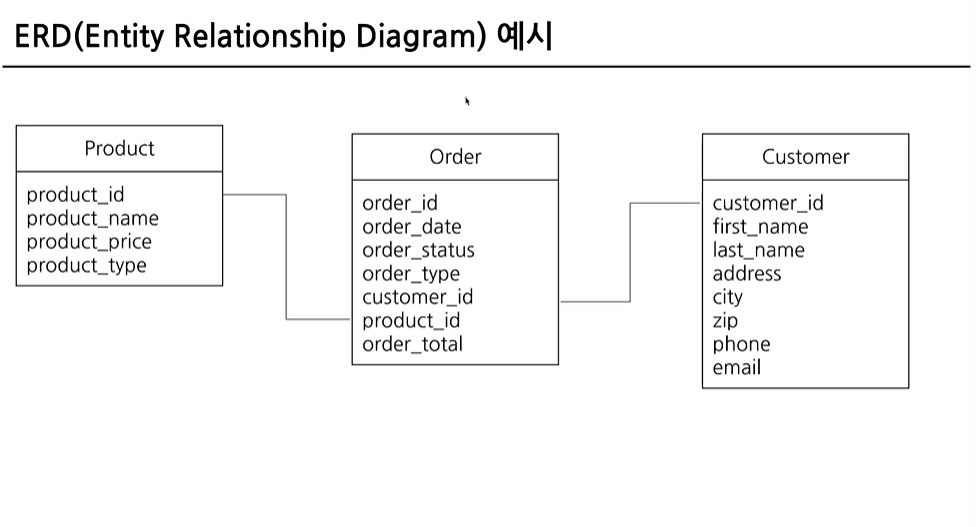

# SQL_BASIC 1주차 정규 과제 

📌SQL_BASIC 정규과제는 매주 정해진 분량의 `초보자를 위한 BigQuery(SQL) 입문` 강의를 듣고 간단한 문제를 풀면서 학습하는 것입니다. 이번주는 아래의 **SQL_Basic_1st_TIL**에 나열된 분량을 수강하고 `학습 목표`에 맞게 공부하시면 됩니다.

**1주차 과제**에서는 수강한 내용을 모두 요약 정리하기보다는, **SQL이 왜 필요한지에 대해 배우고 느낀 점, 그리고 강의를 듣고 본인이 원하는 목표를 중심으로 작성**하여 과제 업로드 시트에 깃허브 링크를 스프레드시트 'SQL' 시트에 붙여서 넣어주세요. 

**👀(수행 인증샷은 필수입니다.)** 

## SQL_BASIC_1st_TIL

### 섹션 2. BigQuery 기초 지식

### 1-1. BigQuery 기초 지식

### 1-2. BigQuery 환경 설정

## 섹션 3. 데이터 탐색 - 조건, 추출, 요약

### 2-1. 데이터 활용 Overview 

### 2-2. 저장된 데이터 확인하기

## 🏁 강의 수강 (Study Schedule)

| 주차  | 공부 범위              | 완료 여부 |
| ----- | ---------------------- | --------- |
| 1주차 | 섹션 **1-1** ~ **2-2** | ✅         |
| 2주차 | 섹션 **2-3** ~ **2-5** | 🍽️         |
| 3주차 | 섹션 **2-6** ~ **3-3** | 🍽️         |
| 4주차 | 섹션 **3-4** ~ **4-4** | 🍽️         |
| 5주차 | 섹션 **4-4** ~ **4-9** | 🍽️         |
| 6주차 | 섹션 **5-1** ~ **5-7** | 🍽️         |
| 7주차 | 섹션 **6-1** ~ **6-6** | 🍽️         |

 

<!-- 여기까진 그대로 둬 주세요-->

---

# 1️⃣ 개념정리 

## 1-1. BigQuery 기본지식

~~~
✅ 학습 목표 :
* 데이터 관련 기초 지식(OLTP, SQL, Row, Column, 저장 형태 등)을 설명할 수 있다. 
* BigQuery 관련 기초 지식에 대해서 파악할 수 있다. 
~~~

database : 데이터의 저장소

ex) MySQL ORACLE Postgre SQL => OLTP

 OLTP란? 
 
 거래를 하기 위해 사용되는 데이터 베이스
    
    특징
    1.데이터 무결-보류 중간 상태 x
    2.데이터의 추가,변경이 많이 발생
    3.SQL로 데이터 추출 가능하나 쿼리속도 느림

OLAP(Online Analytical Processing)란?

-OLTP 보완, 분석 기능 제공 

데이터 웨어하우스  : 데이터를 한곳에 모아 저장

ex) Database, 웹(크롤링) etc.

Big Query  

=Google Cloud OLAP+Data Warehouse
    
    특징
    1. OLAP 도구의 일종으로 속도가 빠르나 그만큼 돈을 지불해야한다는 단점
    2.앱이나 웹 개발 시 사용되는 Firebase , GoogleAnalytics 데이터를 쉽게 추출 가능
    3.적은 인력으로 진행 가능

## 2-1. 데이터 활용 Overview

~~~
✅ 학습 목표 :
* 데이터를 활용하는 과정을 설명할 수 있다.
* 데이터를 탐색하는 과정으로 조건과 추출, 요약을 할 수 있다. 
~~~

데이터 활용 과정

1. task 발생

2. 문제 정의
  -우리가 원하는 것 정의

3. 데이터 탐색
  -단일/다량 선택
  
  4. 데이터 탐색
- 조건을 통한 데이터 필터링
- 데이터 추출
- 데이터 변환
- 요약(집계)
5. 데이터 결과 검증
  -예상과 실제가 다른 경우가 다수 존재, 검증하는 과정이 필요

## 2-2. 저장된 데이터 활용하기

~~~
✅ 학습 목표 :
* 데이터가 저장되는 형태를 알고 저장된 데이터를 활용할 수 있다. 
~~~
저장 데이터

확인 이유

데이터를 제대로 이해해야 올바른 데이터 추출 가능

확인 방법

ERD(Entity Relationship Diagram) : 데이터베이스 구조를 한눈에 알아보기 위해 사용(table,column 확인,key column 확인, column 의미 확인)

---
# 2️⃣ 학습 인증란

 
 

---

# 3️⃣ 확인문제

## 문제 1

> **🧚Q. 포켓몬 게임이나 이커머스 산업과 같이 다양한 산업에서는 각기 다른 데이터가 존재합니다. 다음 중 하나의 산업을 선택하고, 해당 산업에서 수집하고 활용될 수 있는 데이터 항목 (칼럼) 5가지를 자유롭게 상상하여 나열해보세요.**
>
> - 예시 산업 
>
> >  온라인 음식 배달 / 스마트 헬스 케어 / 중고 거래 앱 / 교육 플랫폼 등 

~~~
중고 거래 플랫폼

상품 카테고리 : 가구, 의류, 전자기기

거래 지역 : 서울 , 경기, 부산

소요 시간 : 상품 등록부터 판매완료까지 소요된 시간

거래자 신뢰도 : 거래자의 거래 횟수 거래 후 구매자의 만족도 등을 종합해 측정

조회수 : 상품이 몇번 클릭되었는지 확인

~~~

## 문제 2

> **🧚Q. 이번 강의를 통해 SQL이 왜 필요하다고 느끼는지, SQL을 통해 본인이 어떤 것을 해내고 싶은지를 자유롭게 작성해보세요.**

~~~
주어진 task를 해결하기 위해서는 문제를 정확히 정의하고 이에 맞는 데이터를 탐색하는 과정이 매우 중요하다. 이를 위해 데이터를 체계적으로 분석하는 것은 필수적이며, SQL은 이러한 분석을 가능하게 하는 핵심 도구라고 생각한다. 
이러한 SQL을 활용해 실제 서비스 데이터를 직접 다루며 사용자 행동을 분석하고, 이를 기반으로 의미 있는 비즈니스 인사이트를 도출해내는 역량을 키우고 싶다.
~~~

### 🎉 수고하셨습니다.