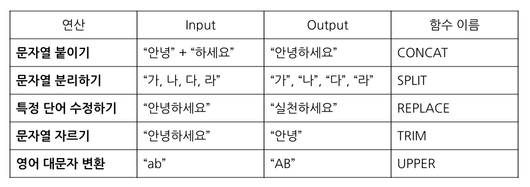

# SQL_BASIC 2주차 정규 과제 

📌SQL_BASIC 정규과제는 매주 정해진 분량의 `초보자를 위한 BigQuery(SQL) 입문` 강의를 듣고 간단한 문제를 풀면서 학습하는 것입니다. 이번주는 아래의 **SQL_Basic_2nd_TIL**에 나열된 분량을 수강하고 `학습 목표`에 맞게 공부하시면 됩니다.

**2주차 과제**는 1주차 과제처럼 SQL의 필요성이나 느낀점 위주가 아닌, **실제 강의 내용을 바탕으로 개념을 정리하고 학습한 내용을 집중적으로 기록**해주세요. 완성된 과제는 Github에 업로드하고, 링크를 스프레드시트 'SQL' 시트에 입력해 제출해주세요. 

**👀(수행 인증샷은 필수입니다.)** 

## SQL_BASIC_2nd

### 섹션 3. 데이터 탐색 - 조건, 추출, 요약

### 2-3. 데이터 탐색 (SELECT, FROM, WHERE)

### 2-4. SELECT 연습문제

### 2-5. 집계 (Group By + Having + Sum/Count)

## 🏁 강의 수강 (Study Schedule)

| 주차  | 공부 범위              | 완료 여부 |
| ----- | ---------------------- | --------- |
| 1주차 | 섹션 **1-1** ~ **2-2** | ✅         |
| 2주차 | 섹션 **2-3** ~ **2-5** | ✅         |
| 3주차 | 섹션 **2-6** ~ **3-3** | 🍽️         |
| 4주차 | 섹션 **3-4** ~ **4-4** | 🍽️         |
| 5주차 | 섹션 **4-4** ~ **4-9** | 🍽️         |
| 6주차 | 섹션 **5-1** ~ **5-7** | 🍽️         |
| 7주차 | 섹션 **6-1** ~ **6-6** | 🍽️         |

 

<!-- 여기까진 그대로 둬 주세요-->

---

# 1️⃣ 개념정리 

## 2-3. 데이터 탐색 (SELECT, FROM, WHERE)

~~~
✅ 학습 목표 :
* SQL 쿼리 구조를 이해할 수 있다. 
* SELECT, FROM, WHERE의 핵심 문법을 설명할 수 있다. 
~~~

<!-- 새롭게 배운 내용을 자유롭게 정리해주세요.-->
SQL 쿼리구조
*빅쿼리는  구글 SQL 사용

--> SQL과 형태가 비슷하고 문법 차이만 존재

SELECT FROM WHERE

SELECT  Col1 AS new_name :
어떤 컬럼을 선책(출력)할 것인가

*as 사용시 컬럼 이름 변경 

FROM Dataset.Table : 어떤 테이블에서 데이터를 확인할 것인가 

WHERE Col1 : 만약 원하는 조건이 있다면 어떤 조건인가

ex) SELECT *
FROM basic.pokemon
WHERE
type 1= "Fire"

*: 모든 컬럼 출력
=> 모든 컬럼 출력인만큼 비용이 커지기에 현업에서는 잘 사용하지 않음

ex) SELECT * EXCEPT(제외할 컬럼)
=> 몇개 제외하고 전체 부르기

; => 

## 2-5. 집계 (Group By / HAVING / SUM,COUNT)

~~~
✅ 학습 목표 :
* 데이터를 집계하고 그룹화하는 방법을 설명할 수 있다.
* GROUP BY, HAVING, ORDER BY, 집계함수(SUM/COUNT 등)을 활용하는 방법을 설명할 수 있다.
* having과 where의 차이에 대해서 설명할 수 있다.
~~~

<!-- 새롭게 배운 내용을 자유롭게 정리해주세요.--> 

GROUP BY : 같은 값끼리 모아서 그룹화한다

SELECT 

col1, 

집계함수 (COUNT,MAX,MIN) 

FROM Table 

GROUP BY col1

count(row 세기)
count if (특정 조건 충족값만 세기)
sum(합계)
average(평균)

DISTINCT : 별개의 여러 값중에 unique한 것만 보고 싶은 경우 사용

DISTINCT의 활용

메인 페이지 VIEW 수 : 4번 
COUNT(user_id)
메인 페이지 VIEW 한 유저의 수 : 3명
COUNT(DISTINCT user_id)

ex)SELECT
  
   gernation

   COUNT(id) AS cnt

   FROM basic_pokemon

   GROUP BY
   generation

조건을 설정하고 싶을 경우 : WHERE/HAVING

WHERE - Table 에 바로 조건을 설정하고 싶은 경우 사용

HAVING -GROUP BY한 후 조건을 설정하고 싶은 경우 사용

서브쿼리=괄호로 묶어서 사용

-SEKECT 문 안에 존재하는  SELECT 쿼리

-FROM 절에 또 다른 SELECT 문을 넣을 수 있다

정렬하기: ORDER BY
순서 : DESC(내림) OSC(오름)

-ORDER BY는 쿼리 맨 마지막에 작성

LIMIT  

-쿼리문의 결과 ROW 수를 제한하고 싶은 경우 LIMIT 사용

-ORDER 다음

SELECT 
  
   type 
   
   COUNT(id) AS cnt
FROM basic_pokemon
GROUP BY 

   type
FROM basic pokemon
HAVING cnt=> 10
ORDER BY cnt DESC

# 2️⃣ 학습 인증란

  

---

# 3️⃣ 확인문제

## 문제 1

> **🧚Q. 포켓몬 마스터 승화는 포켓몬 데이터 조회하는 SQL문에 재미를 느껴서 혼자서 데이터를 조회하는 쿼리문을 짰습니다. 하지만 세 가지의 오류로 다음 코드가 실행이 안된다고 하는데, 각 오류의 위치와 이유를 설명하고, 올바른 쿼리문으로 수정해보세요.**

~~~sql
# 승화의 SQL Query문 
SELECT name AS '포켓몬 이름', ID;
WHERE type = 'Electric';
FROM pokemon;
~~~

~~~
1. select 문 뒤 ';' 삭제
2. where을 from 뒤로 이동
3. from 뒤의 ';' 삭제
~~~

## 문제 2

> **🧚Q. 앞서 SQL Query의 오류를 해결한 승화는 기분 좋게 이번에는 포켓몬 데이터에서 타입별 평균 공격력이 60 이상인 타입만 조회하려는 쿼리를 작성하려고 했습니다. 하지만 이번에도 실수를 하여 쿼리문이 실행되지 않거나 잘못된 결과가 나오고 있는데, 쿼리에서 잘못된 부분이 무엇인지 설명하고, 올바르게 수정한 쿼리를 작성해보세요.**

~~~sql
SELECT type, AVG(attack) AS avg_attack
FROM pokemon
WHERE AVG(attack) >= 60
GROUP BY type;
~~~

~~~
WHERE 절은 그룹화하기 이전 단계에서 행을 거르기 때문에 집계 함수를 사용할 수 없다. 따라서 집계 함수 조건은 WHERE이 아닌 GROUP BY 뒤의 HAVING 절에 작성하는 것이 적절하다.

SELECT type, AVG(attack) AS avg_attack
FROM pokemon
GROUP BY type
HAVING AVG(attack) >= 60;
~~~

### 🎉 수고하셨습니다.