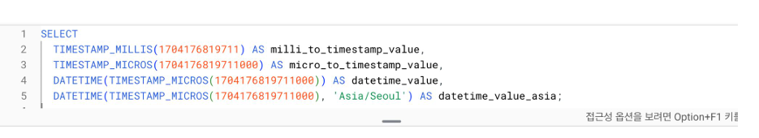
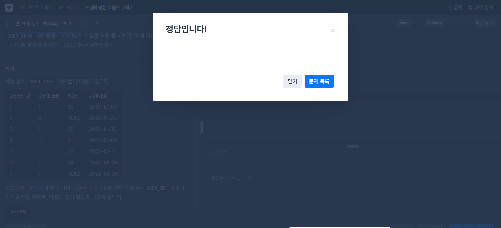
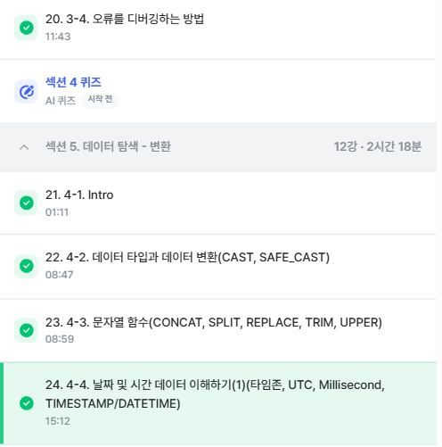

# SQL_BASIC 4주차 정규 과제 

📌SQL_BASIC 정규과제는 매주 정해진 분량의 `초보자를 위한 BigQuery(SQL) 입문` 강의를 듣고 간단한 문제를 풀면서 학습하는 것입니다. 이번주는 아래의 **SQL_Basic_4th_TIL**에 나열된 분량을 수강하고 `학습 목표`에 맞게 공부하시면 됩니다.

**4주차 과제부터는 강의 내용을 정리하는 것과 함께, 프로그래머스에서 제공하는 SQL 문제를 직접 풀어보는 실습도 병행합니다.** 강의에서는 **배운 내용을 정리하고 주요 쿼리 예제를 정리**하며, 프로그래머스 문제는 **직접 풀어본 뒤 풀이 과정과 결과, 배운 점을 함께 기록**해주세요. 완성된 과제는 Github에 업로드하고, 링크를 스프레드시트 'SQL' 시트에 입력해 제출해주세요.

**(수행 인증샷은 필수입니다.)** 

## SQL_BASIC_4th

### 섹션 4. 쿼리 잘 작성하기, 쿼리 작성 템플릿 및 오류를 잘 디버깅하기

### 3-4. 오류를 잘 디버깅하는 방법

## 섹션 5. 데이터 탐색 - 변환

### 4-1. INTRO

### 4-2. 데이터 타입과 데이터 변환(CAST, SAFE_CAST)

### 4-3. 문자열 함수(CONCAT, SPLIT, REPLACE, TRIM, UPPER)

### 4-4. 날짜 및 시간 데이터 이해하기(1) (타임존, UTC, Millisecond, TIMESTAMP/DATETIME)

## 🏁 강의 수강 (Study Schedule)

| 주차  | 공부 범위              | 완료 여부 |
| ----- | ---------------------- | --------- |
| 1주차 | 섹션 **1-1** ~ **2-2** | ✅         |
| 2주차 | 섹션 **2-3** ~ **2-5** | ✅         |
| 3주차 | 섹션 **2-6** ~ **3-3** | ✅         |
| 4주차 | 섹션 **3-4** ~ **4-4** | ✅         |
| 5주차 | 섹션 **4-4** ~ **4-9** | 🍽️         |
| 6주차 | 섹션 **5-1** ~ **5-7** | 🍽️         |
| 7주차 | 섹션 **6-1** ~ **6-6** | 🍽️         |

 

<!-- 여기까진 그대로 둬 주세요-->

---

# 1️⃣ 개념정리

## 3-4. 오류를 디버깅하는 방법

~~~
✅ 학습 목표 :
* 오류의 정의에 대해 설명할 수 있다. 
* 오류 메시지를 보고 디버깅이라는 과정을 수행할 수 있다. 
~~~

# 오류
부정확하거나 잘못된 행동을 의미

# 대표적 오류 카테고리

## 1. Syntax Error 

문법을 지키지 않아 생기는 오류

>ERROR Message 를 보고 해결방법 찾아보는 과정이 필요하다.
---
1.  SELECT list must not be empty at [10:1]
>SELECT       
>col => 이 부분이 비어있어 생기는 오류
FROM
2. Number of arguments does not match for aggregate function COUNT
 >SELECT   
 >COUNT(id,k  or_name)     =>그룹화되거나 집계되지 않은 열  참조, GROUP BY 필요    
 FROM basic.pokemon
3. Syntaxerror : Expectedend of input but got keyword SELECT

> SELECT   
 type1,     
 COUNT(id) AS cnt     
 FROM basic.pokemon  
 GROUP BY   
 type1    =>  입력이 끝날 것으로 예상이 되었으나 'SELECT' 키워드 입력
 >SELECT   
 > *  
   FROM basic.trainer

4. Syntaxerror  : Expected end of input but got keyword WHERE at [5:1]

 >SELECT  
 >*   
 > FROM basic.trainer LIMIT10   => 입력이 끝날 것으로 예상되었지만 [5:1]에서 키워드 WHERE 실행
 WHERE   
 id=3
=>LIMIT은 가장 아래 위치해야한다.
5. Expected ")" but got end of script at [8:11] 

>SELECT  
 >name,   
  FROM(  
 >SELECT  
 > *   
 >FROM   basic.trainer
 WHERE   
 id=3 =>  "괄호 작성 무.

## 4-2. 데이터 타입과 데이터 변환(CAST, SAFE_CAST)

~~~
✅ 학습 목표 :
* 데이터 타입의 종류를 설명할 수 있다. 
* 데이터 타입을 변환하는 방법을 설명할 수 있다. 
~~~
## 데이터 타입
1. 숫자  
2. 문자
3. 시간, 날짜
4. 부울(Bool)

## 데이터 타입이 중요한  이유
보이는 것과 저장된 것의 차이가 존재

> 생각과 다를 때는 변경이 필요
## 자료 타입 변경하기
자료 타입을 변경하는 함수 : CAST

---
ex) SELECT                   
  CAST(1 AS STRING) 

---
## 자료 타입 안전하게 변경
SAFE_CAST
>변환에 실패할 경우 NULL 반환
## 4-3. 문자열 함수(CONCAT, SPLIT, REPLACE, TRIM, UPPER)

~~~
✅ 학습 목표 :
* 문자열 함수들의 종류를 이해하고 어떠한 상황에서 사용하는지 설명할 수 있다. 
~~~
## 문자열 데이터 연산

✅ CONCAT (col1, col2..)
>SELECT   
>  CONCAT("안녕","하세요") AS concat_example

#결과 : "안녕하세요"

✅ SPLIT (문자열 우너본, 나눌 기준이 되는 문자)
>SELECT 
SPLIT("가,나,다,라",",") AS split_example

#결과 : "가","나","다","라"

✅ REPLACE (문자열 원본, 찾을 단어, 바꿀 단어)

> SELECT   
>REPLACE("안녕하세요","안녕","실천") AS replace_example

#결과 : "실천하세요"

✅ TRIM (문자열 원본, 자를 단어)
>SELECT   
 TRIM("안녕하세요","하세요") AS trim_example

#결과 : "안녕"

✅UPPER (문자열 원본)
>SELECT
 UPPER("ab") AS upper_example

#결과 : "AB"

## 4-4. 날짜 및 시간 데이터 이해하기(1) (타임존, UTC, Millisecond, TIMESTAMP/DATETIME)

~~~
✅ 학습 목표 :
* 날짜 및 시간 데이터 타입과 UTC의 개념을 설명할 수 있다. 
* DATE, DATETIME, TIMESTAMP 에 대해서 설명할 수 있다.
* 시간함수들의 종류와 시간의 차이를 추출하는 방법을 설명할 수 있다. 
~~~
## 시간 데이터 다루기 -타임존 x

>DATE : DATE만 표시하는 데이터 , 2023-12-31

>DATETIME : DATE 와 TIME까지 표시하는 데이터,
 <Time zone 정보 없음>

>TIME : 날자와 무관하게 시간만 표시하는 데이터 

## 시간 데이터 다루기 -타임존 o

>GMT(Greenwich Mean Time)

영국의 그리니치 천문대를 기준으로 지역에 따른 시간의 차이를 조정하기 위해 생긴 시간의 구분선

>UTC

국제적인 표준 시간

>TIMESTAMP

시간 도장
UTC부터 경과한 시간을 나타내는 값

## 시간 데이터 다루기 
>milisecond(ms)

1.시간의 단위, 천 분의 1초

2.우리가 아는 초보다 더 짧은 시간 단위

3.빠른 반응이 필요한 분야에서 사용

>microsecond(µs)

1/1,000ms,1/1,000,000초

**회사들이 TIMESTAMP를 요하는 경우가 많음 **

---

# 2️⃣ 확인문제 & 문제 인증

## 프로그래머스 문제 

> 조건에 맞는 회원 수 구하기 (SELECT, COUNT) 
>
> **먼저 문제를 풀고 난 이후에 확인 문제를 확인해주세요**
>
> 문제 링크 
>
> :  https://school.programmers.co.kr/learn/courses/30/lessons/131535#

# 수행확인

## 문제 1

> **🧚Q. 프로그래머스 문제를 풀던 서현이는 여러 번의 시행착오 끝에 결국 혼자 해결하기 어려워 오류 메시지를 공유하며 도움을 요청했습니다. 여러분들이 오류 메시지를 확인하고, 해당 SQL 쿼리에서 어떤 부분이 잘못되었는지 오류 메시지를 해석하고 찾아 설명해주세요.**

~~~sql
# 조건에 맞는 회원 수 구하기 (SELECT, COUNT) 
# 서현이의 SQL 첫 번째 풀이
SELECT COUNT(AGE, JOINED)
FROM USER_INFO
WHERE AGE BETWEEN 20 AND 29
  AND JOINED BETWEEN '2021-01-01' AND '2021-12-31';
  
오류 메시지 : Error: Number of arguments does not match for aggregate function COUNT
 
# 수정하고 난 이후 두 번째 풀이
SELECT AGE, COUNT(*)
FROM USER_INFO
WHERE AGE BETWEEN 20 AND 29
  AND JOINED BETWEEN '2021-01-01' AND '2021-12-31';
  
오류 메시지 : SELECT list expression references column AGE which is neither grouped nor aggregated
~~~

~~~
1번째 메시지

집계 함수 COUNT에 들어간 인자의 개수가 올바르지 않습니다.
COUNT 함수는 하나의 인자만 받을 수 있으므로, 행 개수를 세고 싶다면 COUNT(AGE, JOINED) 대신 COUNT(*)를 사용해야 합니다.

2번째 메시지

SELECT 절에 있는 AGE 컬럼은 집계 함수에도 포함되지 않았고, GROUP BY 절에도 포함되지 않았습니다.
집계 함수(SUM, COUNT, AVG 등)를 다른 컬럼과 함께 사용하려면 반드시 GROUP BY를 통해 그룹화를 진행해야 합니다.

최종 수정본

SELECT AGE, COUNT(*) AS USERS
FROM USER_INFO
WHERE AGE BETWEEN 20 AND 29
  AND JOINED BETWEEN '2021-01-01' AND '2021-12-31'
GROUP BY AGE;
~~~

### 🎉 수고하셨습니다.