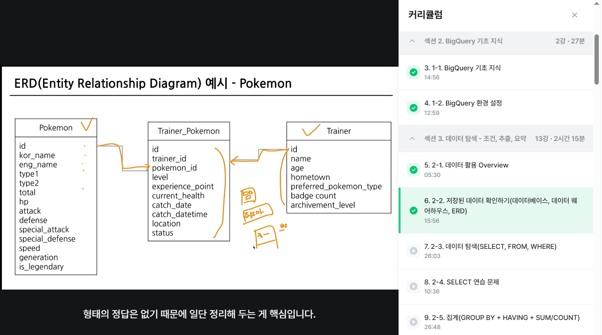

# SQL_BASIC 6주차 정규 과제 

📌SQL_BASIC 정규과제는 매주 정해진 분량의 `초보자를 위한 BigQuery(SQL) 입문` 강의를 듣고 간단한 문제를 풀면서 학습하는 것입니다. 이번주는 아래의 **SQL_Basic_6th_TIL**에 나열된 분량을 수강하고 `학습 목표`에 맞게 공부하시면 됩니다.

**6주차 과제는 강의 내용을 정리하는 것과 함께, 프로그래머스에서 제공하는 SQL 문제를 직접 풀어보는 실습도 병행합니다.** 강의에서는 **배운 내용을 정리하고 주요 쿼리 예제를 정리**하며, 프로그래머스 문제는 **직접 풀어본 뒤 풀이 과정과 결과, 배운 점을 함께 기록**해주세요. 완성된 과제는 Github에 업로드하고, 링크를 스프레드시트 'SQL' 시트에 입력해 제출해주세요.

**(수행 인증샷은 필수입니다.)** 

## SQL_BASIC_6th

### 섹션 6. 다량의 자료를 연결 : JOIN 

### 5-1. Intro

### 5-2. JOIN 이해하기

### 5-3. 다양한 JOIN 방법

### 5-4. JOIN 쿼리 작성하기 

### 5-5. JOIN을 처음 공부할 때 헷갈렸던 부분

### 5-6. JOIN 연습문제 1~2번

### 5-6. JOIN 연습문제 3~5번

### 5-7. 정리

## 🏁 강의 수강 (Study Schedule)

| 주차  | 공부 범위              | 완료 여부 |
| ----- | ---------------------- | --------- |
| 1주차 | 섹션 **1-1** ~ **2-2** | ✅         |
| 2주차 | 섹션 **2-3** ~ **2-5** | ✅         |
| 3주차 | 섹션 **2-6** ~ **3-3** | ✅         |
| 4주차 | 섹션 **3-4** ~ **4-4** | ✅         |
| 5주차 | 섹션 **4-4** ~ **4-9** | ✅         |
| 6주차 | 섹션 **5-1** ~ **5-7** | ✅         |
| 7주차 | 섹션 **6-1** ~ **6-6** | 🍽️         |

<!-- 여기까진 그대로 둬 주세요-->

 

---

# 1️⃣ 개념정리

## 5-2. JOIN 이해하기

~~~
✅ 학습 목표 :
* JOIN에 대한 정의와 필요성에 대해 설명할 수 있다.
~~~

# join

> 서로 다른 데이터 테이블을 연결하는 것

필요 요소 : 테이블 사이에 **공통적으로 존재하는 컬럼(=Key)**

예시 : id, 특정 범위(Date)

## join을 해야하는 이유

관계형 데이터 베이스 설계시 **정규화**  과정 거침

**정규화란?**

>중복을 최소화하게 데이터를 구조화

**관점**

데이터 분석 관점 : join이 되어 있는 경우가 이점

개발 관점 : 분리되어 있는 것이 좋음

## 5-3. 다양한 JOIN 방법

~~~
✅ 학습 목표 :
* JOIN 방법들의 종류를 설명할 수 있다. 
* 각 JOIN 방법들의 차이점에 대해서 설명할 수 있다. 
~~~

## INNER JOIN

>공통 요소만 연결

## LEFT/RIGHT (OUTER) JOIN 

>왼쪽/ 오른쪽 테이블 기준으로 연결

## FULL(OUTER) JOIN

>양쪽 기준으로 연결

## 5-4. JOIN 쿼리 작성하기 

~~~
✅ 학습 목표 :
* JOIN을 사용한 문법에 대해 이해하여 적용할 수 있다.
* JOIN 을 활용한 쿼리를 작성할 수 있다. 
~~~
## 작성 흐름

~~~
1. 테이블 확인 :  테이블에 저장된 데이터, 컬럼 확인

2. 기준 테이블 정의 : 가장 많이 참고할 기준 테이블 정의

3. JOIN KEY 찾기 : 여러 TABLEㅇ과 연결할 KEY ON정리

4. 결과 예상하기 : 결과 테이블을 예상해서 손,엑셀로 작성(일종의 정답지 역할)

5. 쿼리 작성 / 검증 : 예상한 결과와 동일한 결과가 나오는 지 확인
~~~

## SELECT JOIN 문법

FROM 하단에  JOIN 할 TABLE을 작성하고 ON 뒤에 공통된 컬럼(KEY)를 작성
~~~
SELECT
  A.col1,
  A.col2,
  B.col1,
  B.col2
FROM table AS A
LEFT JOIN table2 AS B
ON A.key = B.key
~~~

## 5-6. JOIN 연습문제 1~5번 

~~~
✅ 학습 목표 :
* 연습문제(3문제 이상) 푼 것들 정리하기
~~~

## 1번

트레이너가 봉유한 포켓몬들은 얼마나 있는 알 수 있는 쿼리 작성

**데이터 특징**

-- Released  방출 의미
-- 보유했다는 정의는 status가 Active, Training인 경우를 의미

**쿼리 계산 방법** : 
trainer_pokemon(status가 active, training) +pokemon JOIN => 그 후에 group by 

**JOIN KEY**

~~~
SELECT
  tp*
  p.id
  p.kor_name
  kor_name,
  COUNT(tp.id) AS pokemon_cnt
FROM
   SELECT
     id,
     trainer_id,
     pokemon_id,
     status
   FROM basic.trainer_pokemon
   WHERE
     status IN ("Active", "Training") AS tp
   LEFT JOIN basic.pokemon AS p
   ON tp.pokemon_id = p.id
   GROUP BY
     kor_name
   ORDER BY
     pokemon_cnt DESC
~~~

## 2번

각 트레이너가 가진 포켓몬 중에서 'Grass' 타입의 포켓몬 수 계산

***쿼리 계산 방법** : 

트레이너가 보유한 포켓몬 조건 설정 => Grass 타입으로 Where 조건 걸어서 COUNT 

**JOIN KEY** : 

trainer_pokemon의 pokemon_id 와 pokemon의 id join

~~~
select
type1,
count(tp.id) as pokemon_cnt
from
(SELECT
id,
trainer_id,
pokemon_id,
status
FROM basic.trainer_pokemon 
where status in ("Active", "Training")
) as tp
left join basic.pokemon as p 
on tp.pokemon_id = p.id
where type1 = "Grass"
group by type1
~~~

## 3번

트레이너의 고향과 포켓몬을 포획한 위치를 비교하여 자신의 고향에서 포켓몬을 포획한 트레이너 수 계산

**쿼리 계산 방법**:

 trainer(hometown), trainer_pokemon JOIN => hometown = location => 트레이너 수 카운트

**JOIN KEY** :

 trainer_pokemon의 trainer_id 와 trainer의 id join

~~~
select
  count(distinct tp.trainer_id) as trainer_uniq, 
  count(tp.trainer_id) as trainer_cnt
from basic.trainer_pokemon as tp
left join basic.trainer as t
on tp.trainer_id = t.id
where 
  tp.location is not null 
  and location = hometown
~~~

 

 

---

# 2️⃣ 확인문제 & 문제 인증

## 프로그래머스 문제 

https://school.programmers.co.kr/learn/courses/30/lessons/164673

> 조건에 부합하는 중고거래 댓글 조회하기 (JOIN)

https://school.programmers.co.kr/learn/courses/30/lessons/144854

> 조건에 맞는 도서와 저자 리스트 출력하기 (JOIN)

---

# 3️⃣ 참고자료

JOIN 에 대해서 그림으로 쉽게 이해할 수 있는 자료들도 있어서 첨부합니다. 아래의 블로그도 학습할 때 같이 참고해주세요.

1. https://data-marketing-bk.tistory.com/entry/SQL-JOIN-%ED%95%9C-%EB%B0%A9%EC%97%90-%EC%A0%95%EB%A6%AC-%EA%B0%9C%EB%85%90%EB%B6%80%ED%84%B0-%EC%BD%94%EB%93%9C%EA%B9%8C%EC%A7%80-%EC%9D%B4%EA%B2%83%EB%A7%8C-%EB%B3%B4%EC%9E%90

2. https://velog.io/@wijoonwu/JOIN

 

### 🎉 수고하셨습니다.