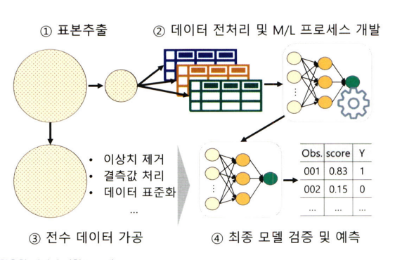
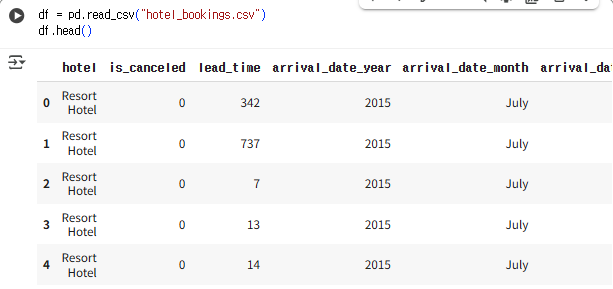
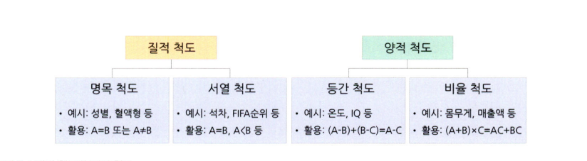
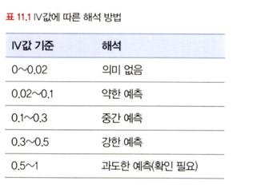

# 통계학 1주차 정규과제

📌통계학 정규과제는 매주 정해진 분량의 『*데이터 분석가가 반드시 알아야 할 모든 것*』 을 읽고 학습하는 것입니다. 이번 주는 아래의 **Statistics_1st_TIL**에 나열된 분량을 읽고 `학습 목표`에 맞게 공부하시면 됩니다.

아래의 문제를 풀어보며 학습 내용을 점검하세요. 문제를 해결하는 과정에서 개념을 스스로 정리하고, 필요한 경우 추가자료와 교재를 다시 참고하여 보완하는 것이 좋습니다.

1주차는 `1부. 데이터 기초체력 기르기`를 읽고 새롭게 배운 내용을 정리해주시면 됩니다.


## Statistics_1st_TIL

### 1부. 데이터 기초체력 기르기
### 01. 통계학 이해하기
### 02. 모집단과 표본추출
### 03. 변수와 척도
### 04. 데이터의 기술 통계적 측정


## Study Schedule

| 주차  | 공부 범위     | 완료 여부 |
| ----- | ------------- | --------- |
| 1주차 | 1부 p.2~46    | ✅         |
| 2주차 | 1부 p.47~81   | 🍽️         |
| 3주차 | 2부 p.82~120  | 🍽️         |
| 4주차 | 2부 p.121~167 | 🍽️         |
| 5주차 | 2부 p.168~202 | 🍽️         |
| 6주차 | 3부 p.203~250 | 🍽️         |
| 7주차 | 3부 p.251~299 | 🍽️         |

<br>

<!-- 여기까진 그대로 둬 주세요-->


# 1️⃣ 개념 정리 
## 01. 통계학 이해하기

```
✅ 학습 목표 :
* 통계학의 필요성에 대해 인식한다.
* 기술통계와 추론통계의 특성을 구분할 수 있다.
```

1.1 통계학을 왜 알아야 할까?

데이터 과학은 기초 통계를 기반으로 발전하였기에 이를 수행함에 있어 통계학은 없어서는 안될 기본 소양이다. 이러한 기본기를 충족하기 않고 데이터분석을 진행하게 되면 분석결과가 도출되어도 의미를 찾고 오류 부분이나 개선방안을 마련하기 어렵다. 

1.2 머신러닝과 전통적 통계학의 차이

머신러닝의 주된 목적은 예측이고  통계학의 주된 목적은 해석이다. 따라서 머신러닝은 예측력이 얼마나 높아가에 집중한다. 반면에 통계학은 모델의 신뢰도를 중시하며 복잡성 보다는 단순성을 추구한다. 즉 머신러닝은 미래를 예측하고 모델에 기반한 정확한 분류나 선택을 하는 것에 목적을 두며 통계
학은 확률변수를 통해 통계적 수치를 검정하는 방향으로 접근하는 것이다.

1.3 통계학의 정의와 기원

통계학 인구조사 과정 중 처음 등장했으며 자료를 수집, 분석하여 그 분석 결과를 통해 효율적인 의사결정을 하는 기법을 연구
하는 학문이다. 

1.4 기술통계와 추론통계

기술통계

기술통계는 주어진 데이터를 사실에 근거해 설명하고 묘사하는 것이다.
가장 기본적인 방법은 그 데이터의 대푯값을 설명하는 것이다 대푯값은 평균, 중앙값, 최빈값 등 다양하다. 이외에도 값의 퍼짐 정도나 최대 /최소의 범위로도 설명이 가능하다. 

이렇게 기술 통계를 내는 것을 EDA라 하며 데이터를 직관적으로 파악하기 위해 주로 시각화 기법을 사용한다.

추론 통계
추론통계는 표본으로부터 모집단의 특성을 추정하는 것이다.이를 이해하기 위해서는 확률분포, 가설 검정, 유의확률 등 핵심 개념에 대한 이해가 필요하다.

기술통계와 추론통계는 독립적인 관계가 아니며 통합 프로세스를 정리하면  다음과 같다. 



## 02. 모집단과 표본추출

```
✅ 학습 목표 :
* 모집단과 표본의 정의와 관계를 설명할 수 있다.
* 편향과 분산의 차이를 설명할 수 있다.
```
2.1 모집단과 표본, 전수조사와 표본조사

모집단이란 분석 대상 전체의 집합을 말하며 그중 일부를 추출한 것을 표본이라 한다. 일반적으로 모집단의 데이터를 모두 구해서 통계분석을 진행하는 것(전수조사)은 시간과 비용의 제약으로 어렵기에 추출한 표본을 통해 모집단의 특성을 추정하고 검정(표본조사)하며 결론을 도출한다.

2.2 표본조사를 하는 이유와 데이터과학 적용 방법

 데이터 과학을 위한 분석 모델링 단계에서는 수많은 테스트와
검증을 한다. 따라서 이 모든 단계를 전수조사 데이터로 수행하면 많은 시
간과 비용이 소모되기에 표본조사를 활용하며 전체 프로세스가 완성됐을 때 전체의 데이터를 사용하여 최종적인 모델 성능을 확인하고 예측 및
분류를 하는 것이 좋다.



2.3 표본추출에서 나타나는 편향의 종류

모집단과 표본은 자연적으로 차이가 존재한다. 이러한 모집단과 표본의 자연 발생적인 변동을 표본 오차 라 한다. 이를 제외한 변동을 비표본 오차라고 한다. 비표본 오차의 한 원
인이 바로 편향이다. 아래는 대표적으로 발생되는 편향이다.

표본추출편향: 표본 추출 과정에서 체계적인 경향이 개입되어 모집단에서 편향된 표본만
추출되는 경우



이러한 편향은 조사 결과의 신뢰도를 떨어뜨리기 때문에 주의가 필요하다.

2.4 인지적 편향의 종류

인지적 편향은 데이터 분석가의 성향이나 상황에 따라 비
논리적인 추론을 내리는 패턴을 뜻한다. 이는 데이터 자체의 문제가 아니라 해석 과정에서 발생하는 왜곡이다.

 확증 편향

 자신이 본래 믿고 있는 대로 정보를 선택적으로 받아들이고 임의로 판단하는 편향이다. 

 기준저 편향

 분석가가 가장 처음에 접하는 정보에 지나치게 매몰되는 편향이다. 

 선택 지원 편향

 본인이 의사결정을 내리는 순간 그 선택의 긍정적인 부분에 대해 더 많이
생각하고 그 결정에 반대되는 증거를 무시하게 되는 편향이다. 

분모 편향

분수 전체가 아닌 분자에만 집중하여 현황을 왜곡하
여 판단하게 되는 편향이다.

생존자 편향

소수의 성공한 사례를 일반화된 것으로 인식함으로
써 나타나는 편향이다.

2.5 머신러닝 모델 측면의 편향과 분산

이러한 편향을 이해하기 위해서는 분산도 함께 이해해야 한다. 편향은 편향은 예측값이 실제값과 일정하게 차이가 나는 정도이고 분산은 동일한 조건에서 예측값이 얼마나 변동하는지를 의미한다. 두 개념은 트레이드오프 관계이며 모델이 단순하면 편향은 커지고 분산은 줄어들며 모델이 복잡하면 편향은 줄고 분산은 커진다. 따라서 최적의 성능을 얻기 위해서는 두 요소의 균형이 필요하다.

2.6 표본 편향을 최소화하기 위한 표본 추출 방법


표본의 신뢰성을 높이기 위해서는 확률적 방법을 활용한 추출이 필요하다. 모집단의 모든 요소가 동일한 확률로 선택될 수 있도록 표본을 뽑는 것이 이상적이며 복원추출이나 비복원추출 방식을 상황에 맞게 적용할 수 있다. 
즉 데이터에 이상이 없는 모집단과 표본프레임이 확정이 되면 확률 표본추출과 비확률 표본
추출 방법 그리고 복원추출과 비복원추출 중 적절한 방법을 선택해야 한다.

## 03. 변수와 척도
```
✅ 학습 목표 :
* 독립변수, 종속변수의 관계를 파악할 수 있다.
* 척도(변수의 데이터적 속성)의 종류를 설명할 수 있다.
```
3.1 변수의 종류

 변수는 연산을 할 수 있는지 여부에 따라 양적변수와 질적변수로 구분된다.

양적변수는 다시 정수만을 취하는 이산변수와 연속적인 실수 값을 취할 수 있는 연속변수로 나눌 수 있다. 

질적변수는 속성만을 나타내는 비계량적 변수로 숫자로 변환하더라도 연산의 의미는 없다. 

변수의 관계적 측면으로 보면 독립변수와 종속변수로 구분된다. 독립변수는 결과에 영향을 주는 원인이고 종속변수는 그에 따른 결과이다. 따라서 독립변수와 종속변수는 기본적으로 서로 상관관계를 갖고 있다. 

독립변수들끼리도 상관관계를 가질 수 있다. 그러나 독립변수 간 상관관계를 최소화할 필요가 있는데 그 이유는 독립변수 간 상관성이 높으면 종속변수와의 관계를 정확히 측정하기 어렵기 때문이다(다중공선성). 

3.2 변수 관계의 종류

인과관계

독립변수와 종속변수의 기본적 관계다. 변수가 다른 변수의 원인이
되는 영향을 미친다.

상관관계 

인과관계의 상위개념으로 두 변수 간 관련성이 존재하는 관계이다. 의미로, 인과관계보다는 넓은 개념이다. 

독립관계 

 변수 간에 상관성, 즉 상관계수가 0인 관계이다. 

의사관계

 변수 간에 상관성은 있지만, 그 상관성이 다른 변수에 의해 나타
난 관계이다.

양방향 인과관계 

두 변수가 서로 영향을 주고받는 관계이다.

조절관계 

독립변수와 종속변수 간 관계의 강도를 제3의 변수가 조절하는 경우를 말한다. 


매개관계 

독립변수의 영향이 매개변수를 거쳐 종속변수로 전달되는 관계이다.


3.3 척도의 종류

데이터를 분석하기 위해서는 수집한 정보를 통계적으로 활용 가능한 척도로 변환해야 한다. 척도란 측정 대상을 수치화하는 기준이며 변수의 성질에 따라 네 가지로 구분된다.


명목척도 

조사대상의 속성이나 범주를 구분하기 위한 목적으로 만들어진 척도다.
다른 척도들보다 정보량이 가장 적다.


서열척도 

조사대상의 속성 크기를 측정하여 대상 간의 순서관계를 측정하는 척도이다. 서열척도는 명목척도와 같이 대상을 서로 구분할 수 있는 정보도 포함하고 있다.


등간척도 

서열척도가 가지고 있는 정보와 함께 조사대상이 가지고 있는 속성의 '상
대적 크기'의 차이를 비교할 수 있는 정보도 가지고 있다.


비율척도 

가장 많은 정보를 담을 수 있는 척도다. 순서에 관한 정보, 대상 간 상대적 크기 정보 그리고 절대적 기준을 통한 비율 정보까지 포함하고 있다.


## 04. 데이터의 기술 통계적 측정

```
✅ 학습 목표 :
* 산포도의 의미를 설명하고 측정방법을 나열할 수 있다.
* 정규분포의 왜도값과 첨도값이 얼마인지 답할 수 있다.
```
4.1 중심경향의 측정: 평균, 중앙값, 최빈값

데이터를 대표하는 하나의 값을 선택할 때 가장 많이 쓰이는 방법은 중심경향을 나타내는 평균, 중앙값, 최빈값을 선택하는 것이다. 평균은 산술평균이 가장 기본적이나 상황에 따라 적용해야 한다. 아래는 평균의 종류이다.

가중평균 

더 많은 비중을 차지하는 집단에 가중치를 더해 합리적인 평균값을 구한다. 

기하평균

시간에 따라 비율적으로 변화하는 값의 평균을 구할 때 사용된다. 

조화평균

 시간적으로 변화하는 데이터에서 평균을 측정하는 방법
이다. 차이는 기하평균이 비율의 평균을 구하는 것이라면 조화평균은 값의 평균을 구하는 것이다. 

4.2 분산과 표준편차

분산과 표준편차는 데이터가 평균을 중심으로 얼마나 흩어져 있는지를 보여주는 지표다. 분산은 각 관측값과 평균의 차이를 제곱해 평균낸 값이고 표준편차는 그 제곱근을 취해 실제 값의 규모와 비슷하게 조정한 값이다. 데이터의 분산이 크면 신뢰성이 떨어지고 작으면 데이터가 일정하다는 의미가 된다. 표본의 경우에는 자유도(n-1)를 적용해 분산을 구하는데, 이는 표본이 모집단보다 분산을 작게 추정하는 경향을 보정하기 위함이다. 

4.3 산포도와 범위, 사분위수, 변동계수

산포도(분산도)는 데이터가 얼마나 흩어져 있는지를 나타내며, 범위, 분산, 표준편차, 사분위수, 변동계수 등을 통해 측정할 수 있다. 범위는 최댓값과 최솟값의 차이이며 사분위수는 데이터를 4등분하여 위치를 나타낸 값이다.  변동계수는 표준편차를 평균으로 나눈 값으로 서로 다른 단위를 가진 데이터의 산포도를 비교할 때 유용하다.

4.4 왜도와 첨도

왜도는 데이터 분포가 좌우로 얼마나 치우쳐 있는지를 나타내는 지표다. 정규분포처럼 좌우대칭일수록 왜도가 0에 가깝고 오른쪽 꼬리가 길면 양수 왼쪽 꼬리가 길면 음수 값을 가진다. 첨도는 분포의 뾰족함 정도를 나타내며 값이 크면 중심에 데이터가 몰려 뾰족한 형태(급첨), 작으면 완만한 형태(완첨)를 의미한다. 

4.5 표준편차의 경험법칙

정규분포에서는 평균과 표준편차를 통해 데이터의 분포 범위를 예측할 수 있다. 이를 경험법칙이라 한다.



<br>
<br>

# 2️⃣ 확인 문제

## 문제 1.

> **🧚Q. 한 회사의 신입사원 A와 B는 같은 직무로 입사했다. 6개월 동안의 근무 평가에서 A는 85점, B는 90점을 받았다. 이때, “B가 A보다 더 유능하다”고 말하는 것은 타당할까?**
>
> **이때 사용자가 확인해야 할 것은 다음 중 무엇인가?**

~~~
1️⃣ 표본 수가 충분한가?
2️⃣ 평가 점수의 평균뿐 아니라 분산(표준편차)은 어떤가?
3️⃣ 데이터가 정규분포를 따른다고 가정할 수 있는가?
4️⃣ 두 사람의 수치 차이에 대해 통계적 검정을 해야 하는가?
~~~


<!--학습한 개념을 활용하여 자유롭게 설명해 보세요. 구체적인 예시를 들어 설명하면 더욱 좋습니다.-->

```
1️⃣ 표본이 단순히 위에서 제시된 점수 하나뿐이라면, 이는 지나치게 작은 표본이므로 충분하지 않다고 볼 수 있다. 그러나 만약 해당 점수가 6개월간 축적된 데이터를 기반으로 한 평균이라면, 표본의 크기는 어느 정도 타당하다고 평가할 수 있다.

2️⃣ 점수의 평균만 확인하는 것에 그치지 않고 분산(표준편차)도 함께 살펴볼 필요가 있다. 두 사람의 점수 차이가 크지 않은 상황에서 B의 분산이 A보다 훨씬 크다면, 평균 점수가 높더라도 일관성이 떨어진다고 볼 수 있다. 이런 경우에는 오히려 A가 더 안정적이고 우수하다고 판단할 여지가 있다.

3️⃣ 데이터가 반드시 정규분포를 따른다고 가정할 필요는 없다. 모수적 검정을 적용하기 위해서는 정규성이 충족되는 것이 바람직하지만 그렇지 않은 경우에도 비모수적 검정을 통해 비교가 가능하다. 따라서 정규분포 가정은 필수적인 전제 조건은 아니다. 그러나 연속형 데이터에 대해서는 모수적 검정을 우선적으로 사용하는 만큼 정규성을 확인하는 것이 권장된다.

4️⃣ 단순히 점수 차이만으로 업무 능력을 단정하는 것은 무리가 있다. 특정 상황에서 높은 점수를 받더라도 다른 경우에 현저히 낮은 점수를 기록할 수 있기 때문이다. 따라서 실제로 두 사람 간 차이가 통계적으로 유의미한지를 확인하기 위해서는 적절한 통계적 검정이 반드시 필요하다.
```


### 🎉 수고하셨습니다.