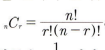
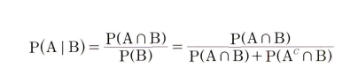

# 통계학 2주차 정규과제

📌통계학 정규과제는 매주 정해진 분량의 『*데이터 분석가가 반드시 알아야 할 모든 것*』 을 읽고 학습하는 것입니다. 이번 주는 아래의 **Statistics_2nd_TIL**에 나열된 분량을 읽고 `학습 목표`에 맞게 공부하시면 됩니다.

아래의 문제를 풀어보며 학습 내용을 점검하세요. 문제를 해결하는 과정에서 개념을 스스로 정리하고, 필요한 경우 추가자료와 교재를 다시 참고하여 보완하는 것이 좋습니다.

2주차는 `1부. 데이터 기초체력 기르기`를 읽고 새롭게 배운 내용을 정리해주시면 됩니다.


## Statistics_2nd_TIL

### 1부. 데이터 기초체력 기르기

### 05. 확률과 확률변수

### 06. 확률분포
### 07. 가설검정


## Study ScheduleStudy Schedule

| 주차  | 공부 범위     | 완료 여부 |
| ----- | ------------- | --------- |
| 1주차 | 1부 p.2~46    | ✅         |
| 2주차 | 1부 p.47~81   | ✅         |
| 3주차 | 2부 p.82~120  | 🍽️         |
| 4주차 | 2부 p.121~167 | 🍽️         |
| 5주차 | 2부 p.168~202 | 🍽️         |
| 6주차 | 3부 p.203~250 | 🍽️         |
| 7주차 | 3부 p.251~299 | 🍽️         |

<!-- 여기까진 그대로 둬 주세요-->


# 1️⃣ 개념 정리 
## 01. 통계학 이해하기

```
✅ 학습 목표 :
* 확률변수의 개념과 종류를 설명할 수 있다.
* 심슨의 역설을 설명하고, 발생 원인을 식별하며, 이를 해결하기 위한 방안을 도출할 수 있다.
```

표본공간 : 통계적 실험을 통해 발생할 수 있는 모든 사건의 집합

표본 점(사건) : 한번의 실험을 통해 발생할 수 있는 특정한 결과 

특정한 표본이 선택될 확률 : 조합



<확률의 종류>

비조건 확률(한계확률) : 아무런 조건이 없는 상황에서 사건이 일어날 확률을 뜻한
다.

결합확률 : 두 개 이상의 사건이 동시에 일어나는 확률

조건부 확률 : 하나의 사건이 먼저 발생했다
는 조건이 전제된 상황에서 또 다른 사건이 발생할 확률

<분할>

사건들을 모두 합했을 때 전체 사건들을 포괄하되, 중복이 일어나지
않는 사건들의 집합



<베이지안 이론>


<확률변수>

측정 값이 변할 수 있는 확률이
주어진 변수가 확률변수다.

ex)표본추출을 어떻게 하는가에 따라 통계량이 달라지는 표본평균이나 표본분
산

<이산확률변수>

 변수가 가질 수 있는 값이 셀 수 있는 실숫값인 변수

<연속확률분포>

연속형 값을 가지기 때문에 나올 수 있는 값들의
개수를 셀 수가 없다.


<심슨의 역설>

 확률의 특성을 고려하지 않으면 잘못된 결과를 도출

## 06. 확률분포

```
✅ 학습 목표 :
* 이산확률분포의 종류와 특징을 설명할 수 있다.
* 연속확률분포의 종류와 특징을 설명할 수 있다. 
* 중심극한정리(CLT)의 개념을 이해하고 설명 할 수 있다.
```

T분포 : 모집단이 정규
분포를 하더라도 분산(02)을 알 수 없고 표본의 수가 적은 상태에서 평균(11)에 대한 신뢰구간 추정 및 가
설검정에 쓰이는 분포

### 06.2. 이산확률분포

> **🧚 이산확률분포에 대해 학습한 내용을 정리해주세요.**

<이산확률분포>

균등분포 : 럼 X가 동일한 확률을 가지는 분포

이항분포 : 1과 0의 값만을 갖는 분포 (성공과 실패가 좋고 나쁨을 의미하지 않으며 결과가 독립적으로 이루어진다)


초기하분포 : 각 시행이 서로 독
립적이지 않아서 시행마다 성공할 확률이 달라지는 분포(비복원추출)

포아송 분포 :  일정한 관측 공간에서 특정 사건이 발생하는 횟수를 나타내는
이산확률분포 

ex)품질관리나 보험상품 개발에 사용


### 06.3. 연속확률분포

> **🧚 연속확률분포에 대해 학습한 내용을 정리해주세요.**

<연속확률 분포>

 연속적인 공간 안에 확률변수가 가질 수 있는
값이 무한히 많기 때문에, 특정한 값을 가질 확률이 0으로 수렴

=> 확률변수 X가 특정 구간(interval)에 속할 확률을 구해야 한다

<정규분포>

평균을 중심으로 좌우 대칭의 종 모양의 형태를 가지고 있는 분포

=> 그래프의 면적을 계산해 확률을 구함

위를 위해 정규분포를 일괄적인 기준으로 표준화시킨다(표준정규분포)

<지수분포>

 특정 사건이 발생한 시점으로부터 다음 사건이 발생할 때까
지의 시간을 확률변숫값으로 하는 분포

= 표준정규분포처럼 절대적인 기준이 없고 평균에 따라 기울기가 정해진다.


## 06.4. 중심극한정리

> **🧚 중심극한정리에 대해 학습한 내용을 정리해주세요.**

 <중심극한정리>


 모집단으로부터 무작위로 표본을 여러 번 추출한 다음, 추출된 각각의
표본들의 평균을 분포로 그려보면 정규분포의 형태를 가진다는 이론


## 07. 가설검정

```
✅ 학습 목표 :
* 귀무가설과 대립가설의 개념을 정의하고, 주어진 연구 질문에 적절한 가설을 설정할 수 있다.
* 가설검정의 유의수준과 p값의 개념을 설명하고, p값을 해석하여 귀무가설을 기각할지 여부를 판단할 수 있다.
* 1종 오류와 2종 오류의 차이를 설명하고, 실제 사례에서 어떤 오류를 더 중요하게 고려해야 하는지 판별할 수 있다.
```

가설 :  연구문제에 대한 잠정적 결론

<데이터 분석>

기술 :  과거나 현재에 어떤 일이 일어났는지를 파악

진단 : 과거나 현재에 발생한 사건의 원인을 밝히기 위한 분석  

예측 : 기계학습 모델 등을 사용하여, 미래에 어떤 일이 어느 정도의 확률로 일어날지를
예측

처방 : 예측되는 미래의 결과를 위해 어떻게 하면 좋을지 처방하기 위한 분석 

<귀무가설>

귀무가설은 H으로 표
기. '새로이 증명하고자 하는 가설과 반대되는 가설'

== 집단 간 차이가 없거나 변수의 영
향력이 없는 상태를 의미

ex)가설 : 컴퓨터 게임 시간이 짧아질수록 성적이 향상될 것이
다.

귀무가설 : 컴퓨터 게임 시간과 성적은 관련이 없다.

<대립가설>

귀무가설과 대립되는 결과에 대한 가설

ex) '컴퓨터
게임 시간이 짧아질수록 성적이 향상될 것이다

<가설 검증 절차>


<유의수준>

귀무가
설이 맞거나 틀린 것을 판단하기 위한 통계값
보통 '0.05' 기준


<검증 오류>


1종 오류: 귀무가설이 참임에도 불구하고 귀무가설을 기각하는 오류.
(실제로 효과가 없는데 효과가 있다고 판단)

==> 오류가 발생할 확률은 a


2종 오류: 귀무가설이 거짓임에도 불구하고 귀무가설을 채택하는 오류.


==> 오류가 발생할 확률은 b

a와 b값은 서로 트레이드오프 관계다
<br>
<br>

# 2️⃣ 확인 문제

## 문제 1.

> **🧚Q. 다음 중 귀무가설(H₀)을 기각해야 하는 경우는 언제인가요? 정답을 고르고, 그 이유를 간단히 설명해주세요.**

> **1️⃣ 유의수준(α)이 0.05이고, p값이 0.03일 때   
> 2️⃣ 유의수준(α)이 0.01이고, p값이 0.02일 때**

```
1번 기각

이유 : p값이 유의수준보다 작다. 따라서 관측된 결과가 귀무가설 하에서 나올 가능성이 희박하다
```


### 🎉 수고하셨습니다.