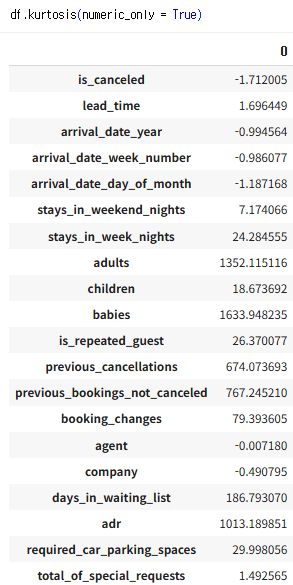
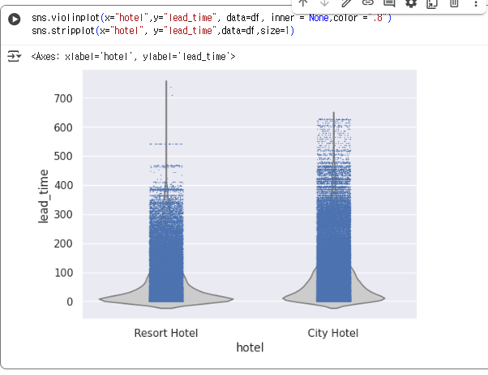

# 통계학 4주차 정규과제

📌통계학 정규과제는 매주 정해진 분량의 『*데이터 분석가가 반드시 알아야 할 모든 것*』 을 읽고 학습하는 것입니다. 이번 주는 아래의 **Statistics_4th_TIL**에 나열된 분량을 읽고 `학습 목표`에 맞게 공부하시면 됩니다.

아래의 문제를 풀어보며 학습 내용을 점검하세요. 문제를 해결하는 과정에서 개념을 스스로 정리하고, 필요한 경우 추가자료와 교재를 다시 참고하여 보완하는 것이 좋습니다.

4주차는 `2부-데이터 분석 준비하기`를 읽고 새롭게 배운 내용을 정리해주시면 됩니다


## Statistics_4th_TIL

### 2부. 데이터 분석 준비하기

### 10. 데이터 탐색과 시각화

<!-- 10. 데이터 탐색과 시각화에서 10.1 탐색적 데이터 분석부터 10.4 비교 시각화 파트까지 진행해주시면 됩니다. -->


**(수행 인증샷은 필수입니다.)** 

<!-- 이번주는 확인 문제가 없고, 교재의 실습에 있는 부분을 따라해주시면 됩니다. 데이터셋과 참고자료는 노션의 정규과제란에 있는 깃허브를 활용해주시면 됩니다. -->


## Study ScheduleStudy Schedule

| 주차  | 공부 범위     | 완료 여부 |
| ----- | ------------- | --------- |
| 1주차 | 1부 p.2~46    | ✅         |
| 2주차 | 1부 p.47~81   | ✅         |
| 3주차 | 2부 p.82~120  | ✅         |
| 4주차 | 2부 p.121~167 | ✅         |
| 5주차 | 2부 p.168~202 | 🍽️         |
| 6주차 | 3부 p.203~250 | 🍽️         |
| 7주차 | 3부 p.251~299 | 🍽️         |

<!-- 여기까진 그대로 둬 주세요-->


---

# 1️⃣ 개념 정리 

## 10. 데이터 탐색과 시각화

```
✅ 학습 목표 :
* EDA의 목적을 설명할 수 있다.
* 주어진 데이터셋에서 이상치, 누락값, 분포 등을 식별하고 EDA 결과를 바탕으로 데이터셋의 특징을 해석할 수 있다.
* 공분산과 상관계수를 활용하여 두 변수 간의 관계를 해석할 수 있다.
* 적절한 시각화 기법을 선택하여 데이터의 특성을 효과적으로 전달할 수 있다.
```
EDA와 데이터 시각화는 구별해서 생각할 필요가 있다

>시각화의 궁극적 목적은 분석 결과를 커뮤니케이션 하기 위함

=> 사람의 흥미를 유발, 전하고자 하는 바 효과적 전달

## 10.1 탐색적 데이터 분석(EDA)

가공하지 않은 원천의 데이터를 있는 그대로 탐색하고 분석하는 기법

> 방법 : 기술 통계와 데이터 시각화

EDA를 할 때는 극단적인 해석은 피해야하며, 추론이나 자의적 해석도 지양해야 한다.

## EDA 목적  
  >#1. 데이터 형태와 척도가 분석에 알맞게 되어 있는지 확인

  >#2 데이터의 평균 ,분산, 분포, 패턴 등의 확인을 통해 데이터 특성 파악

  >#3 데이터의 결측값이나 이상치 파악 및 보완
  
  >#4 변수 간의 관계성 파악
  
  >#5 분석 목적과 방향성 점검 및 보정 
## 10.1.1 엑셀을 활용한 EDA

>엑셀로 1000개의 샘플을 추출해서 보는 것이 좋은 방법이 된다.

=> 직관적 데이터 파악 가능

** 적은 데이터를 다룰 때 특히 유의**

## 10.1.2 탐색적 분석 실습

## 10.1 패키지 임포트


## 10.2 데이터 불러오기 


## 10.3 컬럼 속성 확인


>children,company 결측치 확인 
---
<처리방법>

children 칼럼(4개):  표본제거 방법

company 칼럼(90%) : 결측값 특정명으로 대치

---
## 10.4 칼럼 통계치 확인 


>평균,표준편차 ,최대 최솟값 한 번에 확인 가능

> 문자형과 다른 없는 칼럼 의미 x

=> 각 항목의 빈도 확인하는 방식 분석

## 10.5 칼럼 왜도 확인


## 10.6 컬럼 첨도 확인
 

## 10.7 시각화를 통해 특정 변수의 분포 확인


=> 당일 체크인하는 투숙객이 많은 편임을 확인

## 10.8 그룹 구분에 따른 특정 변수 분포 차이 시각화


# 10.2 공분산과 상관성 분석
---

변수 간의 관계를 파악 :
타깃 변수 y와 입력변수 x 와의 관계는 물론 입력변수 x들 간의 관계도 살펴봐야함

---

> 다중공신성 방지 가능

> 데이터에 대한 이해도 높임

## 10.2.1 공분산
>공분산 : 공유하는 분산

=> 두 분산의 관계


**공분산 공식 **


## 10.2.2 상관계수
>공분산의 한계점 : 각 변수 간의 다른 척도기준이 그대로 반영되어 공분산 값이 지니는 크기가 상관성의 정도를 나타내지 못한다

✅정규화

공분산을 변수 각각의 표준편차 값으로 나누어 상관성 비교

## 상관계수 해석

>상관계수 > 0.7

=상관관계가 매우 높다

>상관계수 > 0.4

=상관관계 일부 보유


산점의 기울기와 상관계수 관련 x


=> 상관계수가 모두 1

---
특징 :

#1. 상관분석은 두 변수의 선형관계만 측정

#2. 2차 방정식 그래프와 유사한 형태 상관분석 결과 매우 낮음

#3. 상관관계가 0이더라도 다른 통계적 관계나 패턴이 숨겨져 있을 수 있으므로 변수 간 관계 평가시 상관계수 뿐 아니라 다양한 통계적 방법과 시각화 기법 사용

---
## 변수 별 상관분석 방법

---
<br>
<br>

## 10.3 시간 시각화

시점 요소가 있는 데이터를 시계열 형태로 표현 가능

> 선그래프 : 시간 간격의 밀도가 높을 때 사용

>추세선 그리기 : 이동평균 사용
/데이터의 연속 그룹의 평균 구하는 방법

>분절형 시간 시각화 : 밀도가 낮을 때 사용 
/ 값들의 상대적 차이 나타내는 것에 유리

>누적 막대그래프 : 한 지점에 2개 이상 세부 항목이 존재할 때 사용

## 비교 시각화

히트맵 차트는 그룹과 비교 요소가 많을 때 효과적으로 시각화 할 수 있는 방법


## 방사형 차트


## 평행 좌표 그래프


평행 좌표 그래프를 효과적으로 표현하려면?

>- 변수별 값을 정규화

>- 가장 낮은 값은 0%로 가장 높은 값은 100%로 변환

>- 여러 변수를 평행으로 배치해서 수치를 표현

---

# 2️⃣ 확인 과제

> **교재에 있는 실습 파트를 직접 따라 해보세요. 실습을 완료한 뒤, 결과화면(캡처 또는 코드 결과)을 첨부하여 인증해 주세요.단순 이론 암기보다, 직접 손으로 따라해보면서 실습해 보는 것이 가장 확실한 학습 방법입니다.**
>
> > **인증 예시 : 통계 프로그램 결과, 시각화 이미지 캡처 등**


~~~
인증 이미지가 없으면 과제 수행으로 인정되지 않습니다.
~~~


### 🎉 수고하셨습니다.