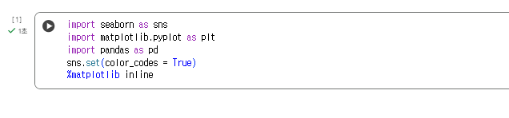
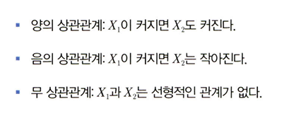

# 통계학 6주차 정규과제

📌통계학 정규과제는 매주 정해진 분량의 『*데이터 분석가가 반드시 알아야 할 모든 것*』 을 읽고 학습하는 것입니다. 이번 주는 아래의 **Statistics_6th_TIL**에 나열된 분량을 읽고 `학습 목표`에 맞게 공부하시면 됩니다.

아래의 문제를 풀어보며 학습 내용을 점검하세요. 문제를 해결하는 과정에서 개념을 스스로 정리하고, 필요한 경우 추가자료와 교재를 다시 참고하여 보완하는 것이 좋습니다.

6주차는 `2부-데이터 분석 준비하기`를 읽고 새롭게 배운 내용을 정리해주시면 됩니다


## Statistics_6th_TIL

### 2부. 데이터 분석 준비하기

### 11. 데이터 전처리와 파생변수 생성

<!-- 11. 데이터 전처리와 파생변수 생성에서 11.1 결측값 처리부터 11.4 데이터 표준화와 정규화 스케일링 파트까지 진행해주시면 됩니다. -->

## Study ScheduleStudy Schedule

| 주차  | 공부 범위     | 완료 여부 |
| ----- | ------------- | --------- |
| 1주차 | 1부 p.2~46    | ✅         |
| 2주차 | 1부 p.47~81   | ✅         |
| 3주차 | 2부 p.82~120  | ✅         |
| 4주차 | 2부 p.121~167 | ✅         |
| 5주차 | 2부 p.168~202 | ✅         |
| 6주차 | 2부 p.203~250 | ✅         |
| 7주차 | 2부 p.251~299 | 🍽️         |

> 과제가 많이 남지 않았습니다. 조금만 더 화이팅해주세요!

<!-- 여기까진 그대로 둬 주세요-->


---

# 1️⃣ 개념 정리 

## 11.데이터 전처리와 파생변수 생성

```
✅ 학습 목표 :
* 결측값과 이상치를 식별하고 적절한 방법으로 처리할 수 있다.
* 데이터 변환과 가공 기법을 학습하고 활용할 수 있다.
* 모델 성능 향상을 위한 파생 변수를 생성하고 활용할 수 있다.
```

### 11.1. 결측값 처리


**선탐색 사항** :

  결측값의 비율, 한 변수에 결측값이 몰려 있지는 않은 지

## 경측값 분류


**완전 무작위 결측(MCAR)**

>결측값이 무작위로 발생한 경우

**특징** 

> 결측값을 포함한 데이터를 제거해도 편향이 거의 발생 x

**무작위 결측(MAR)**

>다른 변수의 특성에 의해 해당 변수의 결측치가 체계적으로 발생한 경우

**특징** 

>결측값은 특성에 영향을 받음

**비무작위 결측(NMAR)**

>결측값들이 해당 변수 자체의 특성을 받고 있는 경우

**특징** 

>결측된 값은 실제로 무엇인지 확인할 수 없으므로 비무작위 결측을 구분하는 것은 어렵다

## 결측값 처리 방법

**표본 제거 방법**: 

>결측값이 심하게 많은 변수 제거

>즉, 결측값이 포함된 행을 제외하고 데이터 분석을 하는 표본 제거 방법을 사용

**특징** 

>전체 데이터에서 결측값 비율이 10% 미만일 경우 o

**평균 대치법**

>결측값을 제외한 온전한 값들의 평균을 구한 다음 그 평균 값을 결측값들에 대치

>평균 대신 사용하는 값들 : 최빈값, 중앙값, 최댓값, 최솟값 

**특징** 

>장점: 사용하기 간단, 결측 표본 제거 방법의 단점을 보완

>단점: 관측됀 데이터의 평균을 사용하기 때문에 통계량의 평균 오차가 왜곡되어 축소되어 나타나고 따라서 p-value 가 부정확

~~~

표본제거방법과 평균 대치법

=> 완전 무작위 결측 시 사용

~~~

**보간법**

전 혹은 다음 시점의 값으로 대치하거나 전 시점과 다음 시점의 평균 값으로 대치하는 방법

**특징** 

> 시계열 특성을 가지고 있을 때 사용

>시점 인덱스의 간격이 불규칙하거나 결측값이 두 번 이상 연달아 있을 때는 선형적인 수치 값을 계산해 보간하는 방법을 사용

>데이터를 시간 순으로 정렬해야한다

**회귀 대치법**

>해당 변수와 다른 변수 사이의 관계성을 고려하여 결측값을 계산  합리적 결측값 처리

**종속변수** : 
회귀식을 이용하여 결측값을 추정
추정하고자 하는 결측값을 가진 변수를 

**독립변수** : 
 나머지 변수

**특징** 

단점 :결측된 변수의 분산을 과소 추정하는 문제

=> 해결방안 : **인위적으로 회귀식에 확률 오차항을 추가하는 확률적 회귀대치법을 사용**하여 변동성을 조정

**다중 대치법**

> 단순 대치법들의 표본오차 과소 추정 문제를 해결

**3가지  단계**




**대치 단계**

 >일반적으로 몬테카를로 방법이나 연쇄방정식을 통한 다중대치를 사용하여 대치값을 임의로 생성,

=>가상 데이터는 5개 내외 정도만 생성

=> 결측값의 비율이 증가할수록 가상 데이터도 많이 생성해야 검정력이 증가

### 11.2. 이상치 처리

#### 이상치 

>일부 관측치의 값이 전체 데이터의 범위에서 크게 벗어난 아주 작거나 큰 극단적인 값을 갖는 것

**특징**

>데이터의 모집단 평균이나 총합을 추정하는 것에 문제 야기

>분산을 과도하게 증가시켜 분석이나 모델링의 정확도를 감소

=> 제거해야한다


**--데이터의 양이 많을 때는 튀는 값이 통곗값에 미치는 영향력이 줄어 이상치 제거의 필요성 x**


### 처리방법

>이상치는 해당 값을 결측값으로 대체한 다음 결측값 처리, 해당 이상치를 제거하는 것이 가장 간단

문제 : 추정치의 분산은 감소하나 실곗값을 과장하여 편향을 방생
대처 방법

**관측값 변경**: 

>하한 값과 상한 값을 결정한 후 하한 값보다 작으면 하한 값으로 대체하고 상한 값보다 크면 상한 값으로 대체

**가중치 조정**: 

>이상치의 영향을 감소시키는 가중치를 주는 방법

### 이상치 확인방법

>데이터 분포 확인을 통해 이상치가 얼마나 포함되어 있는지 가늠

### 이상치 선정

> 1. 박스플롯 상에서 분류된 극단치를 그대로 선정하는 방법

>2. 임의로 허용범위를 설정하여 이를 벗어나는 자료를 이상치로 정의

**주의사항**

>일반적으로 표준편차는 3으로 둔다. 그러나 분포가 비대칭인 경우 (-/+)표준편차 값을 서로 다르게 설정

>평균은 이상치에 통계량이 민감하게 변한다. 따라서 이상치 보다 강건한 중위수와 중위수 절대편차를 사용하는 것 효과적

### 11.3. 변수 구간화


**변수구간화**: 

>데이터 분석의 성능을 향상시키기 위해 혹은 해석의 편리성을 위해 이산형 변수를 범주형 변수로 변환하는 것

이산 => 범주

>각 범주에 해당되는 관측치의 수가 유사해지도록 하여 범주별 분포가 일정하도록 구간화하기도 한다.

**이산형 범주를 범주형 변수로 비즈니스적 상황에 맞도록 변환시켜 데이터의 해석이나 예측, 분류 모델을 의도에 맞도록 유도하는 것**


**특징**

>러스터링, 의사결정나무와 같은 머신러닝 기법을 사용하여 구간 나느기 가능

>클러스터링은 타킷 변수를 설정할 필요 없이 구간화할 변수의 값들을 유사한 수준끼리 묶어줄 수 있다.

>의사결정나무는 타깃 변수를 설정하여 구간화할 변수의 값을 타깃 변수 예측에 가장 적합한 구간으로 나눈다.

## 구간화 확인

>변숫값이 효과적으로 구간화됐는지는 **WOE값, IV값 등을 통해 측정 가능**

>woe 값? =>종속변수 대비 독립변수가 예측력이 얼마나 강한지를 나타내는 지표

> 수치가 높을수록 종속변수의 True와 False를 잘 구분할 수 있는 정보량이 많다는 뜻

>변수가 종속변수를 제대로 설명할 수 있도록 구간화가 잘되면 IV값이 높아잔더


### 11.4. 데이터 표준화와 정규화 스케일링

>독립 변수들이 서로 단위가 다르거나 편차가 심할 때 값의 스케일링을 일정한 수준으로 변환시켜주는 표준화와 정규화 스케일링을 한다.

**그대로 사용해도 무방하지만, 표준화나 정규화는 특정 머신러닝 모델의 학습 효율을 증가**시키기 때문에 많이 사용된다.


**표준화**

>각 관측치의 값이 전체 평균을 기준으로 어느 정도 떨어져 있는지 나타낼 때 사용

**특징**

평균은 0으로 변환

n표준편차 거리는 ±n으로 변환

## Z-score란? 

Zero-mean으로부터 얼마나 떨어져 있는지를 나타냄

>각 관측치 값에서 평균을 빼준 후 표준편차로 나눠주면 됨

**정규화**

>데이터의 범위를 0부터 1까지로 변환하여 데이터 분포를 조정하는 방법

>전체 데이터 중에서 해당 값이 어떤 위치에 있는지 파악하는 데에 유용

**특징**

>0에 가까울수록 작은 값이고 1에 가까울수록 큰 값


<br>
<br>

---

# 2️⃣ 확인 과제

> **교재에 있는 실습 파트를 직접 따라 해보세요. 실습을 완료한 뒤, 결과화면(캡처 또는 코드 결과)을 첨부하여 인증해 주세요.**
>
> **단순 이론 암기보다, 직접 손으로 따라해보면서 실습해 보는 것이 가장 확실한 학습 방법입니다.**
>
> > **인증 예시 : 통계 프로그램 결과, 시각화 이미지 캡처 등**



~~~
인증 이미지가 없으면 과제 수행으로 인정되지 않습니다.
~~~


### 🎉 수고하셨습니다.